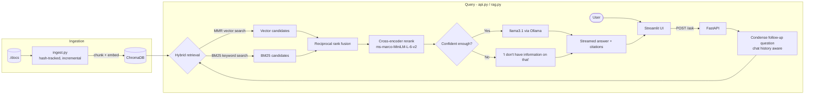

# RAG-SYSTEM

[](https://github.com/niiomar/RAG-SYSTEM/actions/workflows/ci.yml)
[](LICENSE.txt)
[](pyproject.toml)

A fully offline, self-hosted RAG (Retrieval-Augmented Generation) chatbot. Point it at a folder of internal documents and it answers questions about them — grounded, cited, and with nothing leaving the machine.

## Contents

- [Features](#features)
- [Architecture](#architecture)
- [Project Structure](#project-structure)
- [Quickstart](#quickstart)
- [Configuration](#configuration)
- [Running the App](#running-the-app)
- [Running with Docker](#running-with-docker)
- [API Reference](#api-reference)
- [Testing & CI](#testing--ci)
- [Troubleshooting](#troubleshooting)
- [Known Limitations](#known-limitations)
- [Contributing](#contributing)
- [License](#license)

## Features

- **Fully offline** — LLM, embeddings, and reranker all run locally; no data leaves the machine.
- **Hybrid retrieval** — vector similarity (MMR) fused with BM25 keyword search via reciprocal rank fusion, so exact identifiers (e.g. "Act 1040") aren't lost to pure embedding search.
- **Cross-encoder reranking** — cuts fused candidates down to the most relevant chunks before they reach the LLM.
- **Confidence gating** — if nothing retrieved scores above the reranker's relevance threshold, the request short-circuits to "I don't have information on that" instead of letting the LLM improvise around weak context.
- **Cited answers** — every answer references the source document (and page, for PDFs) it was drawn from.
- **Multi-turn memory** — follow-up questions are rewritten against the conversation history before retrieval, so pronouns and references resolve correctly.
- **Incremental ingestion** — re-running ingestion only re-embeds new or changed files (hash-tracked) and removes chunks for deleted ones.
- **Production-lean API** — streaming responses, API-key auth, per-client rate limiting, CORS allowlisting, structured logging, and real liveness/readiness healthchecks.
- **Container-ready** — non-root Docker image, `docker-compose.yml` wiring Ollama + API + UI with health-gated startup ordering.

## Architecture



| Component | Choice |
|---|---|
| LLM | llama3.1 via [Ollama](https://ollama.com) |
| Embeddings | [nomic-embed-text-v1.5](https://huggingface.co/nomic-ai/nomic-embed-text-v1.5) via HuggingFace |
| Reranker | [cross-encoder/ms-marco-MiniLM-L-6-v2](https://huggingface.co/cross-encoder/ms-marco-MiniLM-L-6-v2) |
| Vector store | [ChromaDB](https://www.trychroma.com/) (local, on disk) |
| Keyword search | [BM25](https://pypi.org/project/rank-bm25/) |
| API | [FastAPI](https://fastapi.tiangolo.com/) with streaming responses |
| UI | [Streamlit](https://streamlit.io/) |

`torch` installs from the CPU-only wheel index by default. The LLM itself runs in Ollama, which handles its own GPU acceleration independently; `torch` here is only used for the embedding model and reranker, which don't need a GPU at this project's scale. If you have an NVIDIA GPU and want CUDA-accelerated embeddings/reranking, point `[tool.uv.sources]` in `pyproject.toml` at `https://download.pytorch.org/whl/cuXXX` for your CUDA version instead — see [Troubleshooting](#troubleshooting) for why this matters.

## Project Structure

```
rag-system/
├── docs/          # reference documents to ingest (not tracked in git)
├── vectorstore/   # ChromaDB data + ingestion manifest, generated by ingest.py (not tracked)
├── local_models/  # downloaded embedding + reranker weights (not tracked)
├── tests/         # pytest suite
├── rag.py         # retrieval + reranking + generation chain
├── api.py         # FastAPI backend
├── ingest.py      # incremental document ingestion pipeline
├── ui.py          # Streamlit frontend
├── Dockerfile
├── docker-compose.yml
├── .env.example
└── pyproject.toml
```

## Quickstart

### Prerequisites

- Python 3.14+
- [uv](https://docs.astral.sh/uv/)
- [Ollama](https://ollama.com), with `llama3.1` pulled
- 8GB RAM minimum
- [git-lfs](https://git-lfs.com/) (for downloading models from HuggingFace)

### 1. Install dependencies

```powershell
# Ollama, if you don't have it
irm https://ollama.com/install.ps1 | iex
ollama pull llama3.1

# uv, if you don't have it
irm https://astral.sh/uv/install.ps1 | iex

# Project dependencies, including torch (CPU-only by default — see Architecture above)
uv sync --extra ml
```

`ruff` is a pinned dev dependency (installed above via `uv sync`), run as `uv run ruff check .` so results can't drift between machines. `uv tool install ruff` separately is only useful if you want a bare `ruff` on PATH for editor/IDE integration — the version CI actually enforces is the one in `uv.lock`.

`uv sync` with no `--extra` also works and is enough for linting/tests — see [Testing & CI](#testing--ci).

### 2. Download the models

```powershell
# Embedding model. The upstream repo also bundles several onnx export variants we
# don't use (~5x the size) — skip LFS auto-download on clone, then pull just the
# safetensors weights we actually need.
$env:GIT_LFS_SKIP_SMUDGE = "1"
git clone --depth 1 https://huggingface.co/nomic-ai/nomic-embed-text-v1.5 ./local_models/nomic-embed-text-v1.5
Remove-Item Env:\GIT_LFS_SKIP_SMUDGE
Set-Location ./local_models/nomic-embed-text-v1.5
git lfs pull --include="model.safetensors"
Set-Location ../..

# Reranker model
git clone --depth 1 https://huggingface.co/cross-encoder/ms-marco-MiniLM-L-6-v2 ./local_models/ms-marco-MiniLM-L-6-v2
```

### 3. Ingest your documents

Add `.pdf`, `.docx`, or `.txt` files to `./docs`, then:

```powershell
uv run ingest.py
```

Re-running `ingest.py` only re-embeds files that are new or changed (tracked via `vectorstore/manifest.json`) and removes chunks for files you've deleted. Force a full wipe-and-rebuild with `uv run ingest.py --rebuild`.

### 4. Run it

```powershell
uv run uvicorn api:app --port 8000    # in one terminal
uv run streamlit run ui.py            # in another
```

Ollama must be running first — see [Troubleshooting](#troubleshooting) if `ollama list` doesn't return anything.

## Configuration

All configuration is via environment variables. Copy [`.env.example`](.env.example) to `.env` and fill in as needed:

| Variable | Used by | Purpose | Default |
|---|---|---|---|
| `API_KEY` | api.py, ui.py, ingest.py | Shared secret required on `/ask` and `/admin/refresh` via the `X-API-Key` header. Unset = unauthenticated (fine for local dev, not for anything network-reachable). | unset |
| `ALLOWED_ORIGINS` | api.py | Comma-separated CORS origins allowed to call the API. | `http://localhost:8501` |
| `ASK_RATE_LIMIT` | api.py | Rate limit applied to `/ask`, e.g. `20/minute`. | `20/minute` |
| `OLLAMA_BASE_URL` | api.py | Where to reach Ollama. | `http://localhost:11434` |
| `API_BASE_URL` | ui.py, ingest.py | Where to reach the FastAPI backend. | `http://127.0.0.1:8000` |

## Running the App

Once the API and UI are both running (see [Quickstart](#quickstart)), open the Streamlit UI in your browser (Streamlit prints the local URL, typically `http://localhost:8501`) and ask a question. Example, hitting the API directly:

```powershell
$body = @{ question = "What must a regulated department submit quarterly, and by when?" } | ConvertTo-Json
Invoke-RestMethod -Uri http://127.0.0.1:8000/ask -Method Post -ContentType "application/json" -Body $body
```

```
**Quarterly Signal-Integrity Report Requirements**

* A quarterly signal-integrity report with the Bureau no later than the 15th day of the month following the end of each quarter [1]
* The report must be submitted using the standard NSB-7 form
* The report must include an inventory of active frequency allocations [1]

**Sources:** nsb-act-1040-summary.txt
```

## Running with Docker

```powershell
docker compose up --build
```

This starts Ollama, the API, and the UI as separate services. Pull the model into the Ollama container once, and run ingestion via the one-off `ingest` service:

```powershell
docker compose exec ollama ollama pull llama3.1
docker compose run --rm ingest
```

Set `API_KEY` in your shell (or a `.env` file next to `docker-compose.yml`) before `docker compose up` to enable auth across services.

Containers run as a non-root `appuser` (uid 1000) and expose `/health/ready` (api) / `/_stcore/health` (ui) healthchecks, which `docker-compose.yml` uses to gate startup ordering. On Linux hosts, if the bind-mounted `./docs`, `./vectorstore`, or `./local_models` directories aren't writable by uid 1000, `chown -R 1000:1000` them or adjust the `USER` line in the `Dockerfile`.

## API Reference

| Endpoint | Purpose |
|---|---|
| `POST /ask` | Ask a question (streamed plain-text answer). Body: `{"question": str, "chat_history": [{"role": "user"\|"assistant", "content": str}]}`. Requires `X-API-Key` if `API_KEY` is set; rate-limited via `ASK_RATE_LIMIT`. |
| `POST /admin/refresh` | Rebuilds the hybrid retriever from the current vectorstore contents. Same auth as `/ask`. Called automatically by `ingest.py` after a successful ingest. |
| `GET /health` | Liveness only — process is up. Doesn't touch models or Ollama. |
| `GET /health/ready` | Readiness — builds the RAG chain (if not already built) and pings Ollama. Returns 503 if Ollama is unreachable. This is what `docker-compose.yml` gates startup ordering on. |

Interactive OpenAPI docs are available at `http://127.0.0.1:8000/docs` while the API is running.

## Testing & CI

`torch`/`sentence-transformers` are an optional `ml` extra so tests can install and run fast, without pulling the torch wheel:

```powershell
uv sync
uv run ruff check .
uv run pytest
```

[`.github/workflows/ci.yml`](.github/workflows/ci.yml) runs `uv run ruff check .` and this test suite on every push/PR to `main`. Both `ruff` and its rule selection are pinned (`uv.lock` and `[tool.ruff.lint]` in `pyproject.toml`), so lint results are the same locally and in CI regardless of when either runs.

## Troubleshooting

<details>
<summary><strong>Embedding/reranking crashes with a segfault (no Python traceback)</strong></summary>

This happens when `torch` resolves to a CUDA build on a machine without a matching NVIDIA GPU (e.g. an Intel Arc or AMD GPU) — the CPU fallback path in some CUDA wheels is broken. `pyproject.toml` pins `torch` to the CPU-only wheel index by default specifically to avoid this. If you've overridden it to a `cuXXX` index and don't have a matching NVIDIA GPU + driver, switch back to `https://download.pytorch.org/whl/cpu`, run `uv lock` to regenerate `uv.lock`, then `uv sync --extra ml` again.
</details>

<details>
<summary><strong>`ollama list` returns an error / the API can't reach Ollama</strong></summary>

Ollama isn't running. On Windows it usually starts automatically on boot; if not, start it with `ollama serve`. `GET /health/ready` will return 503 with the underlying connection error until Ollama is reachable.
</details>

<details>
<summary><strong>Follow-up questions or newly ingested documents aren't reflected in answers</strong></summary>

The BM25 half of hybrid retrieval is an in-memory snapshot built when the API starts, so it goes stale after re-ingesting. `ingest.py` automatically calls `POST /admin/refresh` on a running API to rebuild it; if the API wasn't reachable at ingest time (check the log line), call `POST /admin/refresh` yourself or restart the API.
</details>

<details>
<summary><strong>Downloading the embedding model pulls several GB</strong></summary>

The upstream `nomic-embed-text-v1.5` repo bundles multiple onnx export variants alongside the safetensors weights actually used here. Use the `GIT_LFS_SKIP_SMUDGE=1` clone + selective `git lfs pull` shown in [Quickstart](#quickstart) rather than a plain `git clone`.
</details>

<details>
<summary><strong>`ruff check .` passes locally but fails in CI (or vice versa)</strong></summary>

This happened once during development: CI's `uvx ruff check .` fetched a newer, unpinned ruff release with a different default rule set than the version cached locally, so CI failed on rules the local run never saw. `ruff` is now a pinned dev dependency (`uv.lock`) with an explicit rule selection in `[tool.ruff.lint]` (`pyproject.toml`), and both CI and the commands in this README run `uv run ruff check .` — never bare `uvx ruff`, which always resolves "latest" and isn't reproducible.
</details>

## Known Limitations

- **Single shared API key** — `API_KEY` is one secret for all clients. Logs record *what* was asked but not *who* asked it; there's no per-user identity or audit trail.
- **No TLS built in** — if the API is exposed beyond localhost, put it behind a reverse proxy that terminates TLS.
- **Reranker confidence threshold is a heuristic** — `RERANK_CONFIDENCE_THRESHOLD` in `rag.py` uses the cross-encoder's own rule-of-thumb boundary, not a value tuned against your corpus. Adjust it if you see valid answers being suppressed or weak ones passing through.
- **BM25 index staleness** — see the Troubleshooting entry above; it refreshes via `/admin/refresh`, not automatically on a timer.

## Contributing

Before opening a PR: `uv run ruff check .` and `uv run pytest` should both pass (this is exactly what CI checks). Keep changes scoped — this is a small, single-purpose project, and PRs are easiest to review when they touch one concern at a time.

## License

[MIT](LICENSE.txt) © Jason
